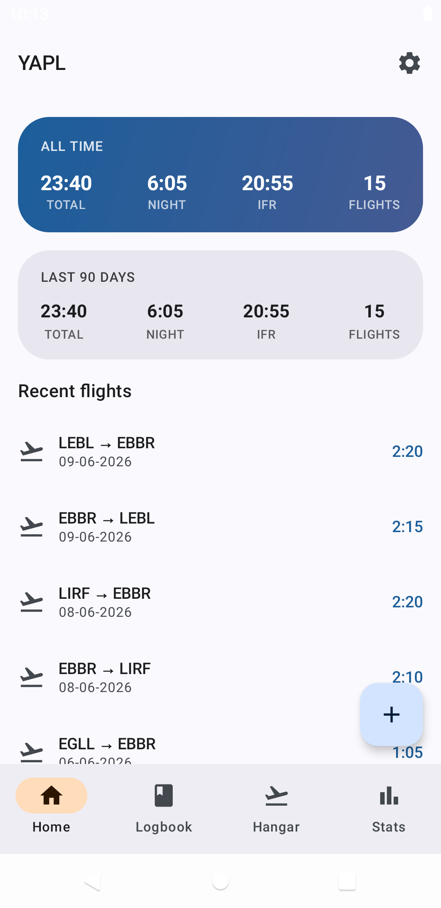
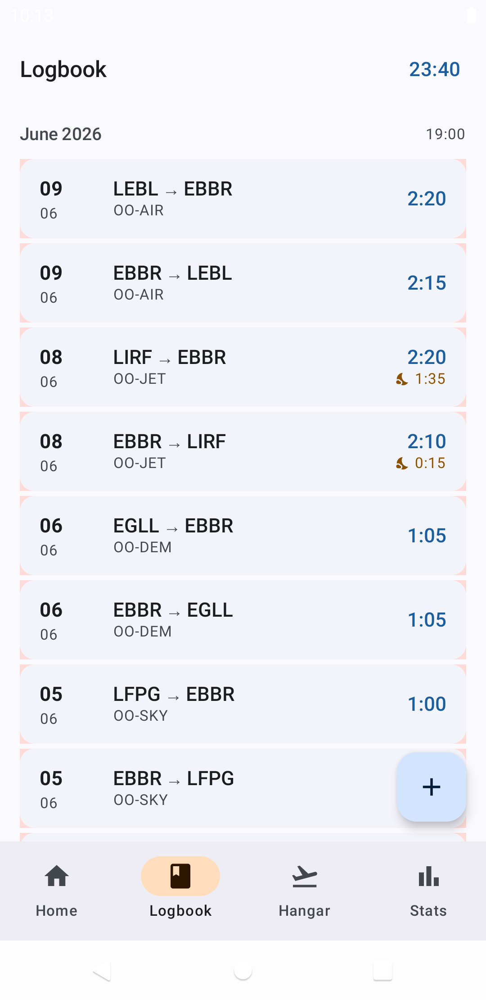
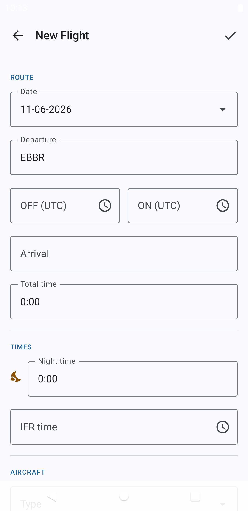
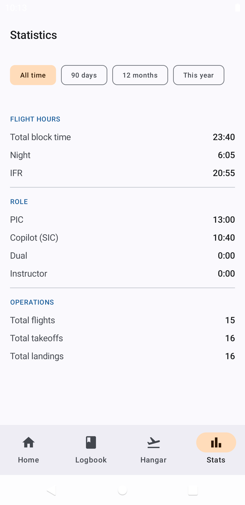

<div align="center">


# YAPL — Yet Another Pilot Log

**A private, offline flight logbook for Android.**

[](LICENSE)


</div>

YAPL is a flight logbook built for professional and general-aviation pilots who
want to keep their hours on their own device — no account, no cloud, no tracking,
no network access at all. It records flights in a clean EASA/BCAA-style structure
and can print a paper-logbook-ready PDF to keep an official book up to date.

## Features

- **Flight logging** — route, block times, aircraft, crew role, day/night
  landings, IFR and night time. Night time is computed automatically from
  sunrise/sunset (NOAA solar algorithm) for each leg.
- **Logbook view** — flights grouped by month with running totals and a fast
  scrollbar for thousands of entries.
- **Statistics** — all-time and rolling 90-day totals (time, night, IFR,
  landings), seeded by your pre-digital *previous totals*.
- **Hangar** — your aircraft types and registrations, kept tidy and reusable.
- **BCAA / EASA PDF export** — generates the official two-page-per-sheet logbook
  layout with per-page and carried-forward totals. Mark **page breaks** in the
  app so the PDF pages line up exactly with your paper book, and export from any
  date (it snaps back to the first flight of that page).
- **Backup & restore** — full flights CSV, plus a JSON reference backup of
  airports, aircraft, settings and previous totals. Import from the legacy
  *Flight Logbook* app's JSON export.
- **Bundled airport database** — 7,697 airports from
  [OurAirports](https://ourairports.com/) for offline lookup.

## Screenshots

<div align="center">




</div>

## Privacy

YAPL declares **no Android permissions**, has **no network code**, and bundles
**no analytics, ads or tracking libraries**. Your flight data never leaves your
device unless *you* export it through the Storage Access Framework. File access
for import/export is granted per-file by the system picker.

## Building

Requirements: JDK 21 and the Android SDK (compile/target SDK 35).

```bash
# Debug build (installs as be.moraine.yapl.debug)
./gradlew assembleDebug

# Release build (minified with R8; installs as be.moraine.yapl)
./gradlew assembleRelease

# Unit tests
./gradlew testDebugUnitTest
```

To sign your own release builds, create a `keystore.properties` file (gitignored)
at the repository root:

```properties
storeFile=/absolute/path/to/your.keystore
storePassword=…
keyAlias=…
keyPassword=…
```

The bundled airport/aircraft database (`app/src/main/assets/airports.db`) is
generated from [OurAirports](https://ourairports.com/) data:

```bash
python3 scripts/build_airports_db.py
```

## Architecture

Clean Architecture in three layers:

- **domain** — models, repository interfaces, use cases (pure Kotlin, unit-tested).
- **data** — Room database, DAOs, entities, mappers, repository implementations.
- **ui** — Jetpack Compose (Material 3) screens, view models, navigation.

Dependency injection with Hilt; persistence with Room; dates with
`kotlinx-datetime`. The app ships with a pre-populated SQLite asset copied to the
live database on first launch and migrated forward in place.

## Credits

- Airport data © [OurAirports](https://ourairports.com/) (public domain).
- Sunrise/sunset from the [NOAA Solar Calculator](https://gml.noaa.gov/grad/solcalc/)
  algorithm.

## License

YAPL is free software licensed under the
[GNU General Public License v3.0](LICENSE). You may use, study, share and improve
it under the terms of that license.
